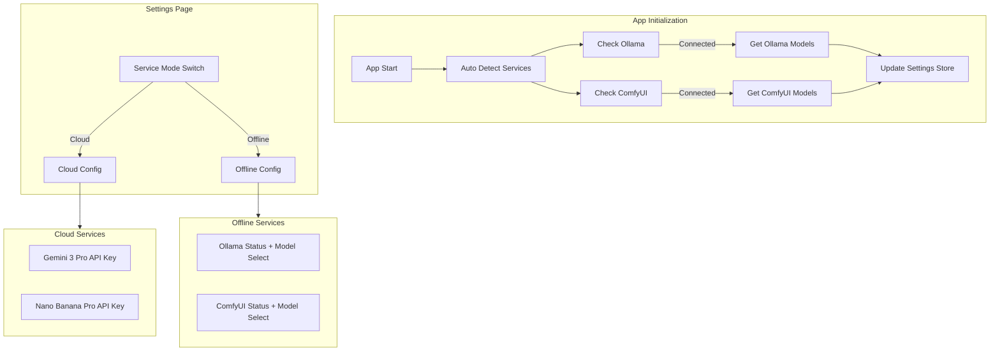

# 離線 AI 服務設置實現計劃

## 架構設計



## 主要修改

### 1. 更新 Settings Store

修改 [`frontend/src/stores/settings.ts`](frontend/src/stores/settings.ts)

新增配置項：

- `serviceMode`: `'cloud' | 'offline'` - 全局服務模式
- `ollamaUrl`: string - Ollama 服務地址（默認 `http://localhost:11434`）
- `ollamaModel`: string - Ollama 模型名稱（如 `llama3`, `qwen2`）
- `comfyuiUrl`: string - ComfyUI 服務地址（默認 `http://localhost:8188`）
- `comfyuiModel`: string - ComfyUI 模型名稱
- `comfyuiWorkflow`: string - ComfyUI 工作流 JSON 配置

### 2. 更新設置頁面 UI

修改 [`frontend/src/views/SettingsView.vue`](frontend/src/views/SettingsView.vue)

新增 UI 元素：

- 服務模式切換開關（雲端/離線）
- 根據模式顯示對應配置區域：
  - **雲端模式**：顯示 Gemini 和 Nano Banana API Key 輸入
  - **離線模式**：顯示 Ollama 和 ComfyUI 配置
- Ollama 配置區：服務地址 + 模型名稱輸入框
- ComfyUI 配置區：服務地址 + 模型名稱 + 工作流 JSON 文本框

### 3. 更新國際化文件

修改三個語言文件添加新翻譯：

- [`frontend/src/i18n/locales/zh-CN.ts`](frontend/src/i18n/locales/zh-CN.ts)
- [`frontend/src/i18n/locales/zh-TW.ts`](frontend/src/i18n/locales/zh-TW.ts)
- [`frontend/src/i18n/locales/en.ts`](frontend/src/i18n/locales/en.ts)

新增翻譯 key：

- `settings.serviceMode` / `settings.cloudMode` / `settings.offlineMode`
- `settings.ollamaUrl` / `settings.ollamaModel` / `settings.ollamaUrlDesc`
- `settings.comfyuiUrl` / `settings.comfyuiModel` / `settings.comfyuiWorkflow` / `settings.comfyuiUrlDesc`

## 設置頁面布局預覽

```
┌─────────────────────────────────────────────┐
│ 服務模式                                     │
│ ┌─────────────┐ ┌─────────────┐             │
│ │  ☁️ 雲端    │ │  💻 離線    │             │
│ └─────────────┘ └─────────────┘             │
├─────────────────────────────────────────────┤
│ [雲端模式時顯示]                             │
│ Gemini API Key: [________________]          │
│ Nano Banana API Key: [________________]     │
├─────────────────────────────────────────────┤
│ [離線模式時顯示]                             │
│ 文本生成 (Ollama)                           │
│ 服務地址: [http://localhost:11434______]    │
│ 模型名稱: [llama3_____________________]     │
│ 狀態: ✅ 已連接 / ❌ 未連接  [檢測連接]      │
│ [查看安裝指南]                               │
│                                             │
│ 圖片生成 (ComfyUI)                          │
│ 服務地址: [http://localhost:8188_______]    │
│ 模型名稱: [stable-diffusion-xl________]     │
│ 狀態: ✅ 已連接 / ❌ 未連接  [檢測連接]      │
│ [查看安裝指南]                               │
│ 工作流配置:                                  │
│ ┌─────────────────────────────────────┐     │
│ └─────────────────────────────────────┘     │
└─────────────────────────────────────────────┘
```

### 4. 創建安裝指南組件

新建 [`frontend/src/components/SetupGuideModal.vue`](frontend/src/components/SetupGuideModal.vue)

彈窗組件，包含：

- Ollama 安裝指南（PowerShell 命令）
- ComfyUI 安裝指南（PowerShell 命令）
- 每個命令旁邊有一鍵複製按鈕

**Ollama 安裝指南步驟：**

1. 下載並安裝 Ollama
2. 啟動 Ollama 服務
3. 下載模型（如 `ollama pull llama3`）
4. 驗證安裝

**ComfyUI 安裝指南步驟：**

1. 安裝 Python 環境
2. 克隆 ComfyUI 倉庫
3. 安裝依賴
4. 下載模型到指定目錄
5. 啟動 ComfyUI 服務

### 5. 添加連接檢測功能

在 [`frontend/src/services/api.ts`](frontend/src/services/api.ts) 添加：

```typescript
// 檢測 Ollama 服務是否可用並獲取模型列表
async checkOllamaConnection(url: string): Promise<{ connected: boolean; models?: string[] }>

// 檢測 ComfyUI 服務是否可用並獲取模型列表
async checkComfyUIConnection(url: string): Promise<{ connected: boolean; models?: string[] }>
```

通過調用本地服務的 API 端點來檢測：

- Ollama: `GET {url}/api/tags` - 返回可用模型列表
- ComfyUI: `GET {url}/system_stats` 和 `GET {url}/object_info` - 返回系統狀態和可用模型

### 6. 自動檢測功能

在 Settings Store 中添加自動檢測邏輯：

**Store 新增狀態：**

- `ollamaConnected`: boolean - Ollama 連接狀態
- `ollamaAvailableModels`: string[] - Ollama 可用模型列表
- `comfyuiConnected`: boolean - ComfyUI 連接狀態
- `comfyuiAvailableModels`: string[] - ComfyUI 可用模型列表
- `isDetecting`: boolean - 是否正在檢測中

**自動檢測流程：**

1. 在 `main.ts` 初始化時調用 `settingsStore.autoDetectServices()`
2. 並行檢測 Ollama 和 ComfyUI 服務
3. 如果服務可用，自動獲取可用模型列表
4. 更新 store 中的連接狀態和模型列表
5. 如果離線服務可用且未設置服務模式，自動切換到離線模式

**設置頁面顯示：**

- 模型選擇從輸入框改為下拉選單（顯示檢測到的模型）
- 如果未檢測到模型，顯示輸入框供手動輸入
- 連接狀態實時顯示（檢測中 / 已連接 / 未連接）